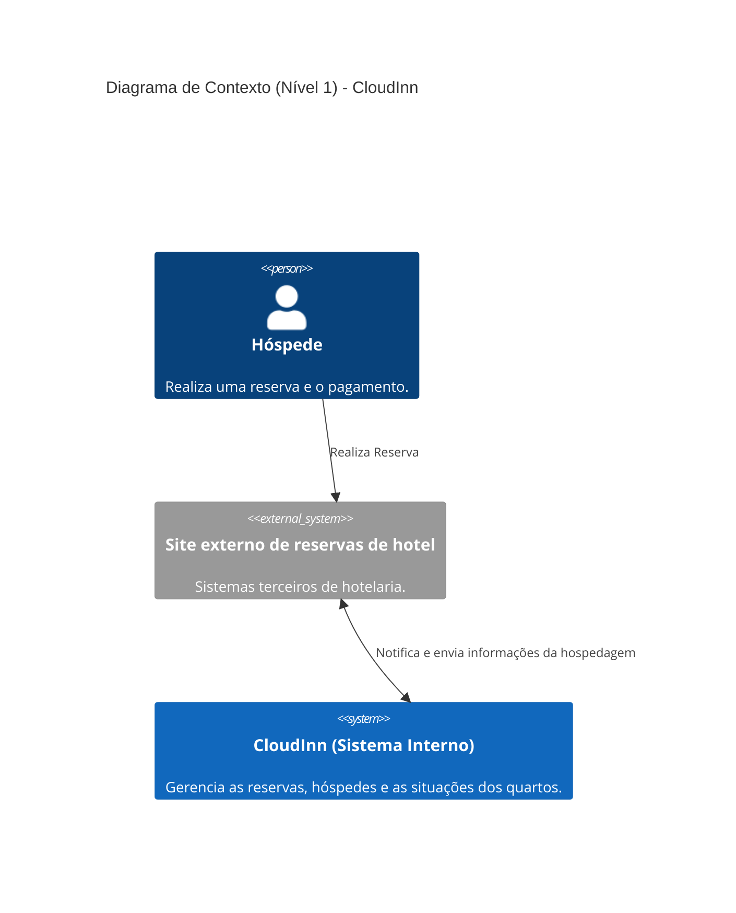
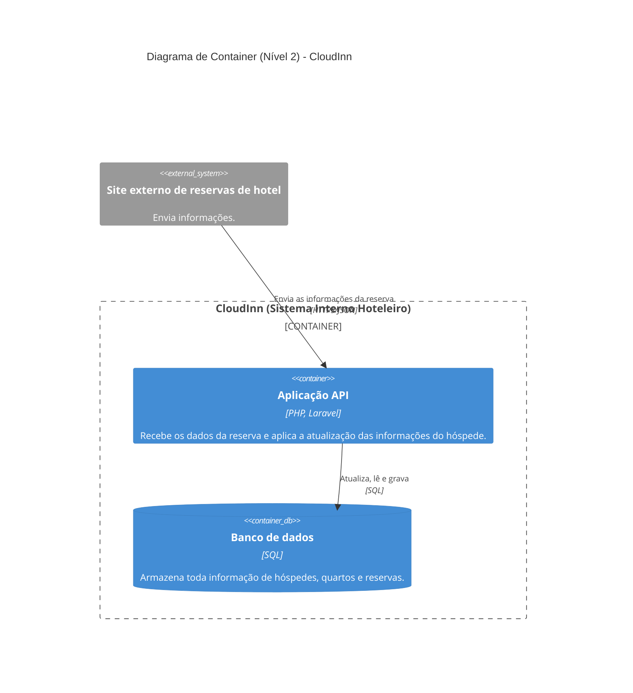
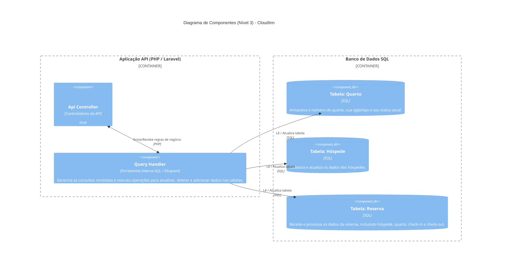

# CloudInn - Arquitetura de Sistema

**Data:** Agosto de 2026
**Grupo:** 10

## Equipe de Alunos

| Integrantes              |
| :----------------------- |
| Alyson Ferreira de Souza |
| Flavia Cristina Fagundes |
| Lucas Aioria Serpa       |
| Matheus Pereira Siqueira |

## Descrição do Sistema

O CloudInn é um sistema interno de gestão hoteleira responsável por receber e processar informações de reservas enviadas por sites externos e parceiros do hotel. O sistema recebe informações como dados do hóspede, quarto, data de check-in e data de check-out, realizando o cadastro e a atualização no banco de dados. Além disso, o sistema controla o status dos quartos durante o ciclo de hospedagem, permitindo acompanhar situações como reservado, ocupado, sujo, em limpeza e disponível.

---

## 1. Introdução e Objetivos

Descreve os requisitos relevantes e as forças motrizes que os arquitetos de software e a equipe de desenvolvimento devem considerar. Isso inclui os recursos essenciais, metas de qualidade e partes interessadas.

### 1.1 Visão Geral dos Requisitos (Requisitos Funcionais)

Abaixo estão listados os requisitos funcionais essenciais mapeados para o funcionamento do CloudInn:

|    ID    | Descrição do Requisito                                                              |
| :------: | :---------------------------------------------------------------------------------- |
| **RF01** | O sistema deve receber notificações de reservas provenientes de parceiros externos. |
| **RF02** | O sistema deve cadastrar os dados dos hóspedes.                                     |
| **RF03** | O sistema deve registrar reservas.                                                  |
| **RF04** | O sistema deve registrar as datas de check-in e check-out.                          |
| **RF05** | Associar um quarto à reserva.                                                       |
| **RF06** | Atualizar o status dos quartos.                                                     |
| **RF07** | Registrar o check-in do hóspede.                                                    |
| **RF08** | Registrar o check-out do hóspede.                                                   |
| **RF09** | Alterar o status do quarto para sujo após o check-out.                              |
| **RF10** | Registrar a limpeza do quarto.                                                      |
| **RF11** | Disponibilizar o quarto após a limpeza.                                             |

### 1.2 Objetivos de Qualidade

Os três principais objetivos de qualidade para a arquitetura, cujo cumprimento é de maior importância para as partes interessadas:

| Prioridade | Objetivo de Qualidade | Cenário Concreto                                                                                                       |
| :--------: | :-------------------- | :--------------------------------------------------------------------------------------------------------------------- |
|     1      | **Confiabilidade**    | O sistema não pode perder dados das notificações de reservas enviadas pelos parceiros externos.                        |
|     2      | **Desempenho**        | O sistema deve atualizar o status dos quartos no painel de recepção em tempo real para evitar conflitos de hospedagem. |
|     3      | **Segurança**         | Garantir a privacidade e a proteção adequada das informações sensíveis dos hóspedes no banco de dados.                 |

### 1.3 Partes Interessadas (Stakeholders)

Pessoas, funções ou organizações que precisam trabalhar com a arquitetura ou com o sistema:

| Função/Nome                | Expectativas                                                                                             |
| :------------------------- | :------------------------------------------------------------------------------------------------------- |
| **Recepcionistas / Staff** | Interface clara e rápida para gerenciar check-in, check-out e verificar o status atualizado dos quartos. |
| **Hóspedes**               | Que suas reservas sejam registradas corretamente e que os quartos estejam prontos no check-in.           |
| **Sistemas Parceiros**     | API estável, documentada e com alta disponibilidade para notificar reservas com sucesso.                 |

---

## 2. Restrições Arquiteturais

Qualquer requisito que restrinja os arquitetos de software em sua liberdade de decisões de design e implementação.

| Categoria       | Restrição               | Explicação                                                                                                             |
| :-------------- | :---------------------- | :--------------------------------------------------------------------------------------------------------------------- |
| **Tecnológica** | **PHP e Laravel**       | O backend da aplicação, incluindo as APIs de recebimento, deve ser desenvolvido em PHP utilizando o framework Laravel. |
| **Tecnológica** | **Banco de Dados SQL**  | O armazenamento deve ser feito utilizando um banco de dados relacional SQL padrão.                                     |
| **Integração**  | **Interfaces Externas** | O sistema deve suportar integração externa para comunicação de dados com sistemas hoteleiros parceiros terceirizados.  |

---

## 3. Contexto e Escopo

## 4. Estratégia de Solução

## 5. Visão de Blocos de Construção

