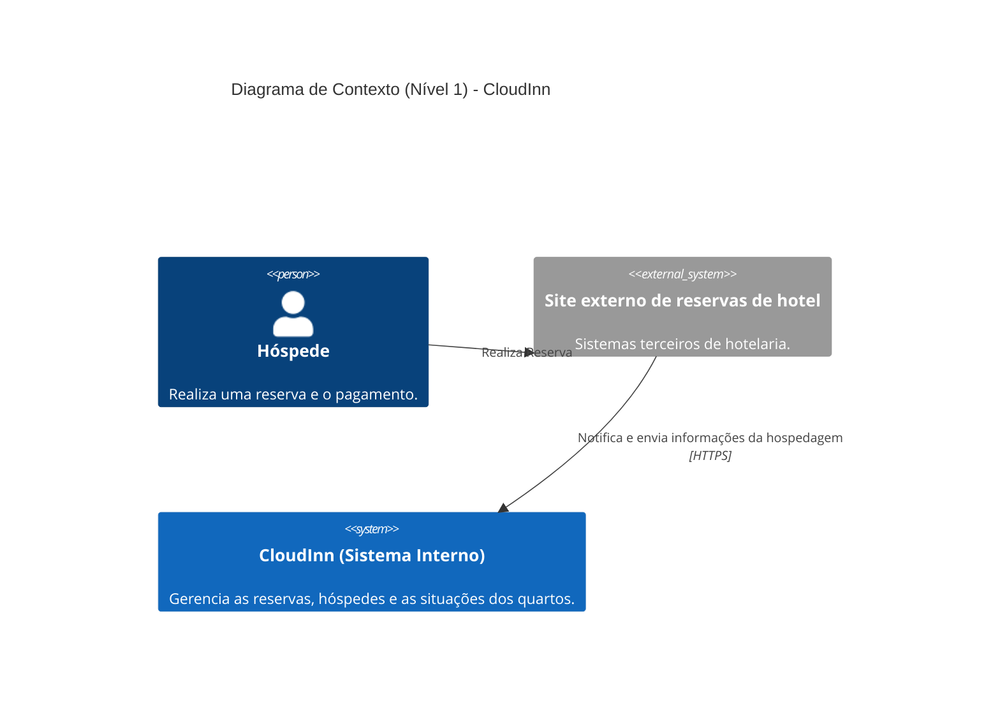
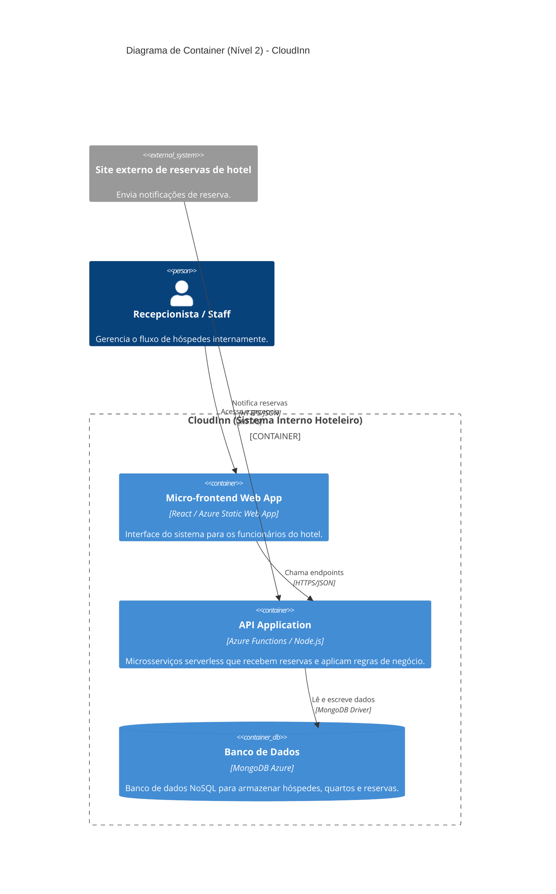
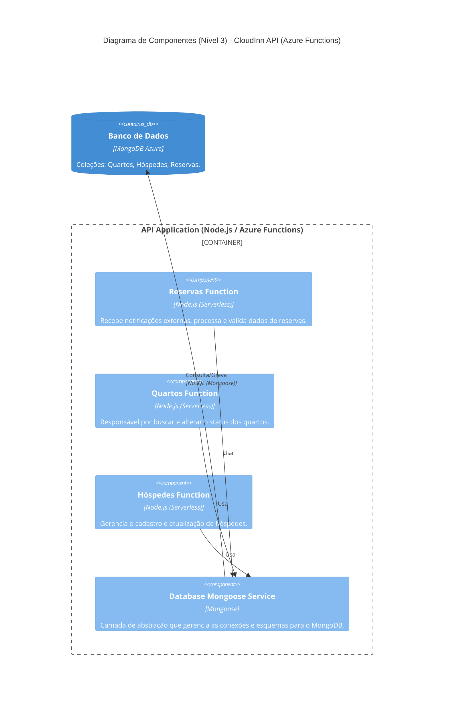
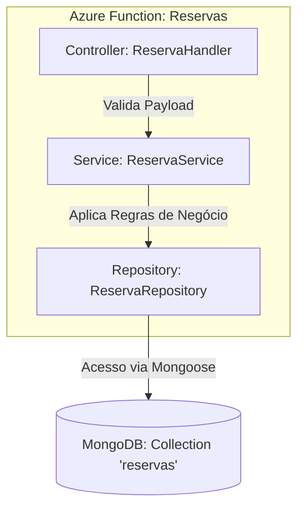
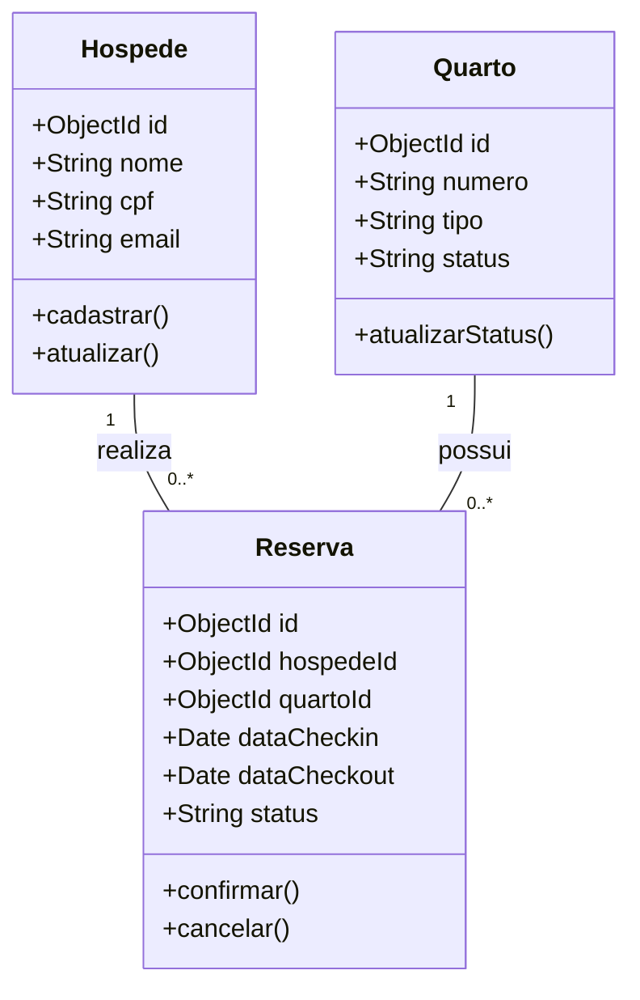
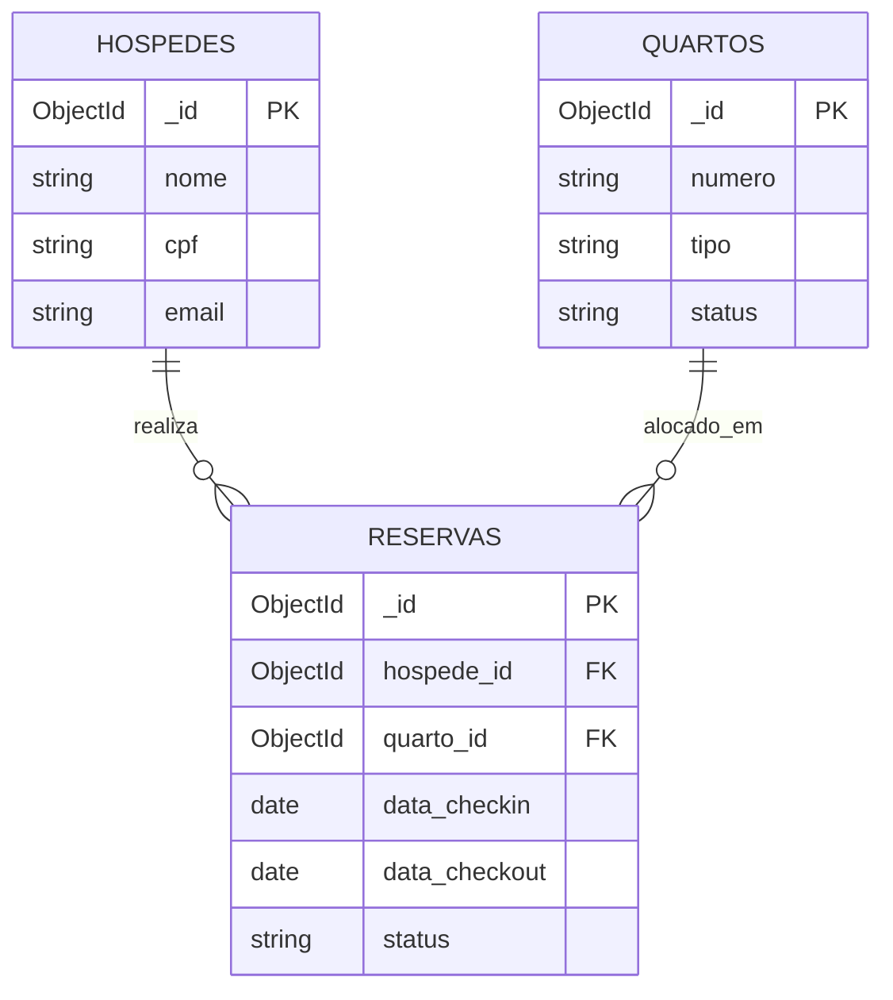
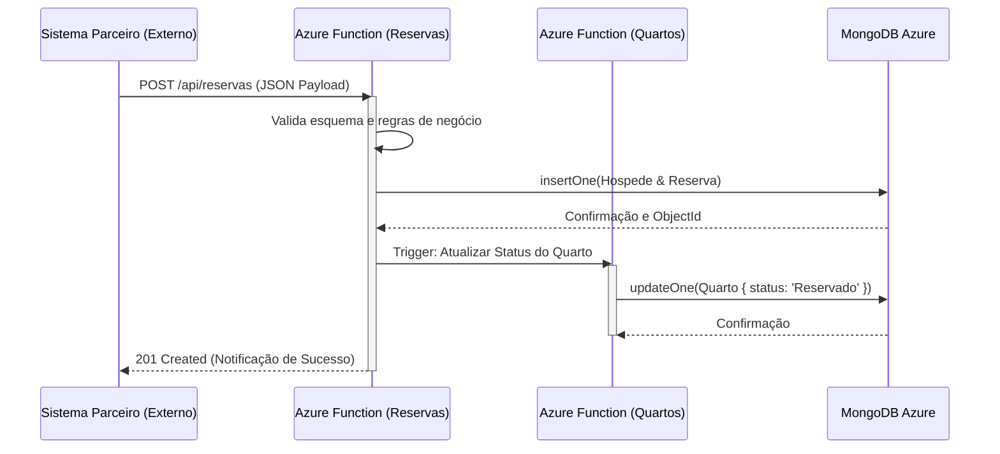

# Contexto

```mermaid
C4Context
    title Diagrama de Contexto (Nível 1) - CloudInn

    Person(hospede, "Hóspede", "Realiza uma reserva e o pagamento.")
    System_Ext(Sistema_parceiro, "Site externo de reservas de hotel", "Sistemas terceiros de hotelaria.")
    System(Sistema_interno_hoteleiro, "CloudInn (Sistema Interno)", "Gerencia as reservas, hóspedes e as situações dos quartos.")

    Rel(hospede, Sistema_parceiro, "Realiza Reserva")
    Rel(Sistema_parceiro, Sistema_interno_hoteleiro, "Notifica e envia informações da hospedagem", "HTTPS")
```

---

## Container

```mermaid
C4Container
    title Diagrama de Container (Nível 2) - CloudInn

    System_Ext(Sistema_parceiro, "Site externo de reservas de hotel", "Envia notificações de reserva.")
    Person(recepcionista, "Recepcionista / Staff", "Gerencia o fluxo de hóspedes internamente.")

    Container_Boundary(c1, "CloudInn (Sistema Interno Hoteleiro)") {
        Container(spa, "Micro-frontend Web App", "React / Azure Static Web App", "Interface do sistema para os funcionários do hotel.")
        Container(api, "API Application", "Azure Functions / Node.js", "Microsserviços serverless que recebem reservas e aplicam regras de negócio.")
        ContainerDb(db, "Banco de Dados", "MongoDB Azure", "Banco de dados NoSQL para armazenar hóspedes, quartos e reservas.")
    }

    Rel(Sistema_parceiro, api, "Notifica reservas", "HTTPS/JSON")
    Rel(recepcionista, spa, "Acessa e gerencia", "HTTPS")
    Rel(spa, api, "Chama endpoints", "HTTPS/JSON")
    Rel(api, db, "Lê e escreve dados", "MongoDB Driver")
```

---

## Componentes

```mermaid
C4Component
    title Diagrama de Componentes (Nível 3) - CloudInn API (Azure Functions)

    Container_Boundary(api_bound, "API Application (Node.js / Azure Functions)") {
        Component(reserva_func, "Reservas Function", "Node.js (Serverless)", "Recebe notificações externas, processa e valida dados de reservas.")
        Component(quarto_func, "Quartos Function", "Node.js (Serverless)", "Responsável por buscar e alterar o status dos quartos.")
        Component(hospede_func, "Hóspedes Function", "Node.js (Serverless)", "Gerencia o cadastro e atualização de hóspedes.")
        Component(db_service, "Database Mongoose Service", "Mongoose", "Camada de abstração que gerencia as conexões e esquemas para o MongoDB.")
    }

    ContainerDb(db, "Banco de Dados", "MongoDB Azure", "Coleções: Quartos, Hóspedes, Reservas.")

    Rel(reserva_func, db_service, "Usa")
    Rel(quarto_func, db_service, "Usa")
    Rel(hospede_func, db_service, "Usa")
    Rel(db_service, db, "Consulta/Grava", "NoSQL (Mongoose)")
```

---

## Componentes

```mermaid
flowchart TD
    subgraph ReservasFunction [Azure Function: Reservas]
        C[Controller: ReservaHandler]
        S[Service: ReservaService]
        R[Repository: ReservaRepository]
    end
    C -->|Valida Payload| S
    S -->|Aplica Regras de Negócio| R
    R -->|Acesso via Mongoose| BD[(MongoDB: Collection 'reservas')]
```

### Blocos em construção

```mermaid
classDiagram
    class Hospede {
        +ObjectId id
        +String nome
        +String cpf
        +String email
        +cadastrar()
        +atualizar()
    }
    class Reserva {
        +ObjectId id
        +ObjectId hospedeId
        +ObjectId quartoId
        +Date dataCheckin
        +Date dataCheckout
        +String status
        +confirmar()
        +cancelar()
    }
    class Quarto {
        +ObjectId id
        +String numero
        +String tipo
        +String status
        +atualizarStatus()
    }
    Hospede "1" -- "0..*" Reserva : realiza
    Quarto "1" -- "0..*" Reserva : possui
```

## Banco de dados

```mermaid
erDiagram
    HOSPEDES ||--o{ RESERVAS : "realiza"
    QUARTOS ||--o{ RESERVAS : "alocado_em"

    HOSPEDES {
        ObjectId _id PK
        string nome
        string cpf
        string email
    }
    RESERVAS {
        ObjectId _id PK
        ObjectId hospede_id FK
        ObjectId quarto_id FK
        date data_checkin
        date data_checkout
        string status
    }
    QUARTOS {
        ObjectId _id PK
        string numero
        string tipo
        string status
    }
```

```mermaid
sequenceDiagram
    participant Parceiro as Sistema Parceiro (Externo)
    participant FuncReserva as Azure Function (Reservas)
    participant FuncQuarto as Azure Function (Quartos)
    participant DB as MongoDB Azure

    Parceiro->>FuncReserva: POST /api/reservas (JSON Payload)
    activate FuncReserva
    FuncReserva->>FuncReserva: Valida esquema e regras de negócio
    FuncReserva->>DB: insertOne(Hospede & Reserva)
    DB-->>FuncReserva: Confirmação e ObjectId

    FuncReserva->>FuncQuarto: Trigger: Atualizar Status do Quarto
    activate FuncQuarto
    FuncQuarto->>DB: updateOne(Quarto { status: 'Reservado' })
    DB-->>FuncQuarto: Confirmação
    deactivate FuncQuarto

    FuncReserva-->>Parceiro: 201 Created (Notificação de Sucesso)
    deactivate FuncReserva
```
