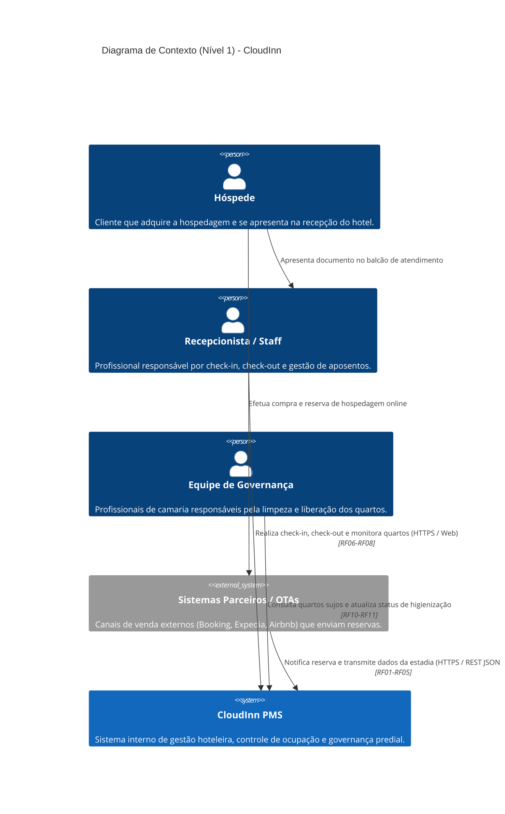
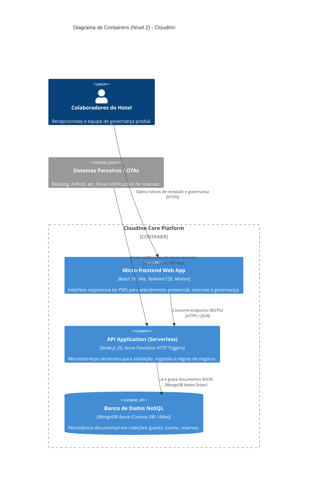
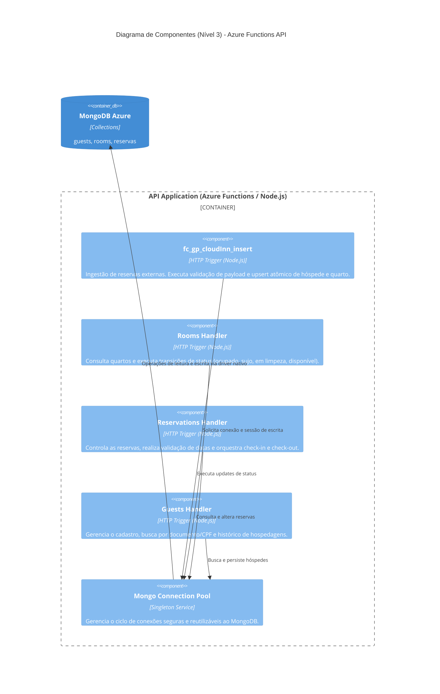
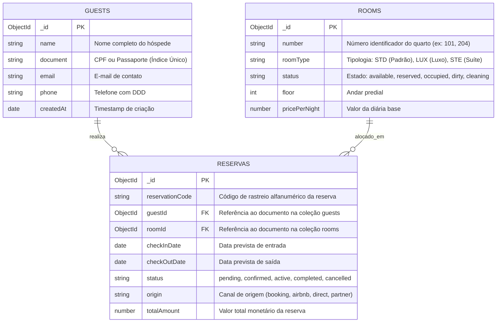
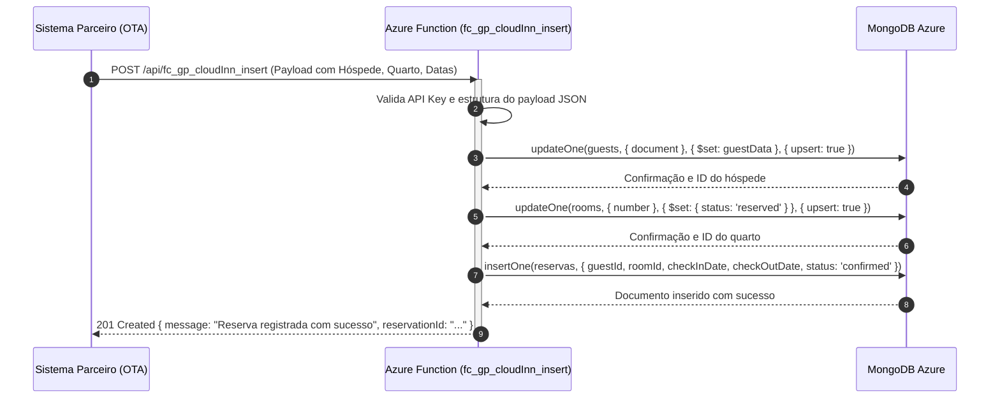
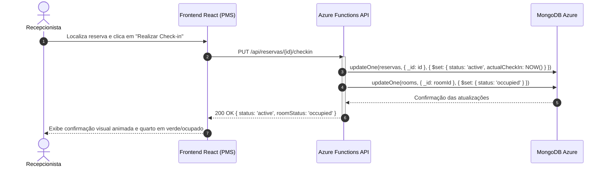
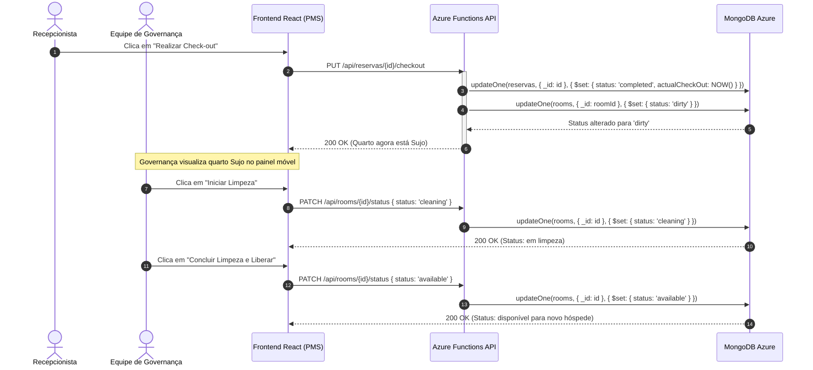
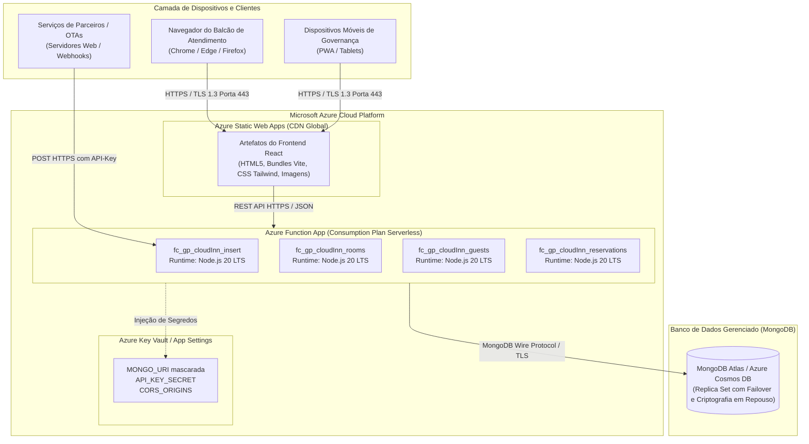

# CloudInn — Arquitetura de Sistema (arc42)

**Versão da Arquitetura:** 2.0.0  
**Data:** Outubro de 2026  
**Template:** arc42 (Versão 8.2-PT)  
**Grupo:** 10

## Equipe de Alunos

| Integrantes              | Papel na Arquitetura                                     |
| :----------------------- | :------------------------------------------------------- |
| Alyson Ferreira de Souza | Integrações Serverless, Pipeline de Dados e Persistência |
| Flavia Cristina Fagundes | Requisitos, Modelagem de Domínio e Contratos OpenAPI     |
| Lucas Aioria Serpa       | Micro-frontend React, Motion Design e UX Operacional     |
| Matheus Pereira Siqueira | Infraestrutura em Nuvem, Resiliência e Segurança         |

---

## Descrição do Sistema

O **CloudInn** é um sistema corporativo de gestão hoteleira (_Property Management System_ - PMS) concebido para automatizar o ciclo operacional de hospedagem de ponta a ponta. A plataforma é responsável por receber, validar e processar notificações de reservas transmitidas por canais parceiros e agências de turismo online (OTAs — _Online Travel Agencies_), além de fornecer à equipe de recepção e governança uma interface reativa de alta produtividade.

O sistema controla o ciclo de vida completo dos hóspedes, a alocação e precificação de quartos, e a esteira de estados operacionais dos aposentos (`disponível`, `reservado`, `ocupado`, `sujo` e `em limpeza`), garantindo sincronização em tempo real entre a recepção e a equipe de governança predial.

---

## 1. Introdução e Objetivos

Esta seção estabelece as forças motrizes, os requisitos essenciais de negócio, as metas de qualidade prioritárias e os atores envolvidos na operação do CloudInn.

### 1.1 Visão Geral dos Requisitos (Requisitos Funcionais)

A arquitetura do CloudInn foi desenhada para atender estritamente aos requisitos funcionais (RF01 a RF11), mapeados conforme o ciclo da hospedagem hoteleira:

|    ID    | Requisito Funcional                             | Descrição Detalhada e Comportamento Esperado                                                                                                                                        |
| :------: | :---------------------------------------------- | :---------------------------------------------------------------------------------------------------------------------------------------------------------------------------------- |
| **RF01** | **Recebimento de Notificações de Reservas**     | O sistema deve expor endpoints RESTful seguros para receber e autenticar notificações de reservas emitidas por canais e parceiros externos em formato JSON padronizado.             |
| **RF02** | **Cadastro e Atualização de Hóspedes**          | O sistema deve registrar ou atualizar os dados cadastrais dos hóspedes (nome, documento/CPF, e-mail, telefone) de forma idempotente com base em chave única de identificação civil. |
| **RF03** | **Registro e Controle de Reservas**             | O sistema deve criar e gerenciar o ciclo de vida das reservas com status auditáveis (`pending`, `confirmed`, `active`, `completed`, `cancelled`).                                   |
| **RF04** | **Registro de Datas de Check-in e Check-out**   | O sistema deve armazenar as datas e horários estipulados de entrada e saída, impedindo reservas com inconsistência temporal (ex.: check-out anterior ou coincidente ao check-in).   |
| **RF05** | **Alocação de Quarto à Reserva**                | O sistema deve vincular um quarto físico específico à reserva, validando sua compatibilidade com a tipologia solicitada (STD, LUX, STE) e sua disponibilidade no período.           |
| **RF06** | **Atualização de Status dos Quartos**           | O sistema deve permitir a alteração e propagação imediata do status de cada quarto, refletindo instantaneamente as transições operacionais no painel da recepção.                   |
| **RF07** | **Registro de Check-in do Hóspede**             | O sistema deve registrar formalmente a entrada do hóspede no hotel, associando-o ao quarto alocado e alterando o estado do aposento para `ocupado` (_occupied_).                    |
| **RF08** | **Registro de Check-out do Hóspede**            | O sistema deve registrar a saída do hóspede, finalizar a reserva como concluída (_completed_) e acionar automaticamente a rotina de higienização.                                   |
| **RF09** | **Transição Automática para Quarto Sujo**       | Imediatamente após a finalização do check-out, o sistema deve marcar o quarto como `sujo` (_dirty_), bloqueando novas alocações imediatas.                                          |
| **RF10** | **Registro de Início de Limpeza**               | A equipe de governança deve poder sinalizar quando o quarto estiver em processo de higienização, transitando o status para `em limpeza` (_cleaning_).                               |
| **RF11** | **Disponibilização do Quarto Pós-Higienização** | Após a conclusão e vistoria da limpeza, o quarto deve ser retornado ao status de `disponível` (_available_), ficando apto a receber novos hóspedes.                                 |

### 1.2 Objetivos de Qualidade

Os objetivos de qualidade arquiteturais foram priorizados e estruturados segundo a norma internacional **ISO/IEC 25010**:

| Prioridade | Característica de Qualidade      | Objetivo Arquitetural                                                                                     | Cenário Concreto                                                                                                                                                         |
| :--------: | :------------------------------- | :-------------------------------------------------------------------------------------------------------- | :----------------------------------------------------------------------------------------------------------------------------------------------------------------------- |
|   **1**    | **Confiabilidade & Integridade** | Garantir que 100% dos payloads válidos de reservas externas sejam persistidos sem perdas ou duplicidades. | Em picos de tráfego de parceiros externos, a função de ingestão processa payloads com estratégia de _upsert_ atômico, garantindo idempotência e integridade referencial. |
|   **2**    | **Desempenho & Eficiência**      | Proporcionar tempos de resposta sub-segundo em todas as rotinas interativas da recepção.                  | O carregamento da grade de ocupação e a alteração de status de quartos no frontend reativo devem responder em tempo inferior a 400ms em condições normais de rede.       |
|   **3**    | **Segurança & Conformidade**     | Proteger dados pessoais e de contato dos hóspedes contra acessos não autorizados.                         | Todas as requisições à API exigem tráfego sob TLS/HTTPS e validação de `api_key` corporativa no cabeçalho HTTP; credenciais de banco de dados são mascaradas em logs.    |
|   **4**    | **Usabilidade & Produtividade**  | Reduzir o tempo operacional do atendente na recepção durante o check-in e check-out.                      | A interface web adota transições fluidas com _motion design_, busca preditiva e atalhos de ação direta, viabilizando o check-in em menos de 3 cliques.                   |

### 1.3 Partes Interessadas (Stakeholders)

| Função / Ator                 | Descrição e Papel                                 | Expectativas Principais em Relação ao Sistema                                                                                                |
| :---------------------------- | :------------------------------------------------ | :------------------------------------------------------------------------------------------------------------------------------------------- |
| **Recepcionistas do Hotel**   | Usuários operacionais do balcão de atendimento    | Interface visual rápida, sem bloqueios de tela, com clareza imediata sobre quais quartos estão prontos para receber hóspedes.                |
| **Equipe de Governança**      | Camareiras e supervisores prediais                | Visão atualizada dos quartos sujos e capacidade de atualizar o status de limpeza em tempo real via dispositivos móveis/tablets.              |
| **Hóspedes**                  | Clientes finais do estabelecimento hoteleiro      | Agilidade e pontualidade no check-in, garantia de quarto devidamente higienizado e segurança em relação a seus dados cadastrais.             |
| **Sistemas Parceiros / OTAs** | Plataformas terceirizadas (Booking, Airbnb, etc.) | API pública com especificação OpenAPI (Swagger) estável, alta taxa de disponibilidade (99,9%) e retorno estruturado de confirmação HTTP 201. |
| **Gestores Hoteleiros**       | Administradores e gerentes gerais                 | Relatórios de ocupação confiáveis, baixa taxa de cancelamento por inconsistência de dados e ausência de _overbooking_.                       |
| **Equipe de Engenharia**      | Desenvolvedores e operadores de infraestrutura    | Arquitetura modular serverless de baixa manutenção, código desacoplado, esteira com testes automatizados e logs auditáveis.                  |

---

## 2. Restrições Arquiteturais

As decisões técnicas e organizacionais do CloudInn são delimitadas pelas seguintes restrições:

| Categoria                      | Restrição                                    | Justificativa e Impacto Arquitetural                                                                                                                                       |
| :----------------------------- | :------------------------------------------- | :------------------------------------------------------------------------------------------------------------------------------------------------------------------------- |
| **Tecnológica (Backend)**      | **Serverless com Azure Functions & Node.js** | A camada de processamento de regras de negócio e ingestão é desacoplada em microsserviços serverless na nuvem Azure, garantindo escala automática e cobrança por execução. |
| **Tecnológica (Persistência)** | **MongoDB (NoSQL Document Store)**           | Armazenamento de dados baseado em documentos flexíveis no MongoDB (Azure Cosmos DB ou MongoDB Atlas), suportando dados dinâmicos de parceiros e indexação ágil.            |
| **Tecnológica (Frontend)**     | **Single Page Application em React & Vite**  | Interface desenvolvida em React moderno, estilizada com utilitários Tailwind CSS e enriquecida com microinterações via Motion.                                             |
| **Contrato e Padronização**    | **Conformidade Estrita com OpenAPI 3.0.4**   | Todos os endpoints e payloads devem respeitar a especificação formal presente no arquivo `/doc/api/swagger.yaml`.                                                          |
| **Comunicação e Rede**         | **Protocolo HTTPS Obrigatório**              | Toda a comunicação entre clientes web, canais externos e funções serverless deve ocorrer exclusivamente através de conexões encriptadas TLS 1.3 / HTTPS.                   |
| **Operacional & Deploy**       | **Arquitetura Cloud-Ready**                  | O sistema deve operar sem dependência de estado local (_stateless_), viabilizando deploys contínuos e migrações ágeis entre ambientes de homologação e produção.           |

---

## 3. Contexto e Escopo

### 3.1 Contexto de Negócio

O CloudInn opera como a espinha dorsal de governança e controle de hospedagem do hotel, interagindo com atores humanos internos e ecossistemas externos de reservas:



### 3.2 Contexto Técnico e Interfaces

| Interface Externa        | Protocolo / Transporte | Formato de Dados |       Autenticação / Segurança        | Papel na Arquitetura                                                                          |
| :----------------------- | :--------------------: | :--------------: | :-----------------------------------: | :-------------------------------------------------------------------------------------------- |
| **Ingestão de Reservas** |      HTTPS / POST      |       JSON       |     API Key (`api_key` no header)     | Recebe payloads de parceiros externos disparando a função `fc_gp_cloudInn_insert`.            |
| **Consumo do Frontend**  |      HTTPS / REST      |       JSON       |    Sessão de Staff / Bearer Token     | Comunicação entre a SPA React e os microsserviços serverless de quartos, hóspedes e reservas. |
| **Acesso à Base NoSQL**  | MongoDB Wire Protocol  |       BSON       | TLS + URI autenticada com credenciais | Conexão gerenciada com _connection pool_ reutilizável entre invocações serverless.            |

---

## 4. Estratégia de Solução

A arquitetura do CloudInn adota uma estratégia orientada a serviços serverless e reatividade visual, combinando resiliência para entradas em lote com alta responsividade no balcão:

```text
┌─────────────────────────────────────────────────────────────────────────────────┐
│                          ESTRATÉGIA ARQUITETURAL CLOUDINN                       │
├─────────────────────────────────────────────────────────────────────────────────┤
│                                                                                 │
│   [ Canais Externos ]       [ Staff do Hotel ]                                  │
│            │                        │                                           │
│            ▼                        ▼                                           │
│   ┌─────────────────┐      ┌─────────────────┐                                  │
│   │ API Key Header  │      │ React 19 SPA    │  <- Reatividade, Tailwind CSS,   │
│   │ Validação JSON  │      │ Cache Local     │     Motion Design (zero recarga) │
│   └────────┬────────┘      └────────┬────────┘                                  │
│            │                        │                                           │
│            └───────────┬────────────┘                                           │
│                        ▼                                                        │
│            ┌─────────────────────────────────────────────────────────────┐      │
│            │ Azure Functions Serverless (Node.js 20 LTS)                 │      │
│            │ • fc_gp_cloudInn_insert                                     │      │
│            │ • Handlers RESTful de Quartos, Hóspedes e Reservas          │      │
│            │ • Validação de esquemas e regras temporais de check-in/out  │      │
│            └───────────┬─────────────────────────────────────────────────┘      │
│                        ▼                                                        │
│            ┌────────────────────────┐                                           │
│            │ MongoDB Azure NoSQL    │  <- Operações atômicas de Upsert          │
│            │ Coleções:              │     Índices em CPF/Document e Número      │
│            │ guests, rooms, reservas│     Alta disponibilidade com Replica Set  │
│            └────────────────────────┘                                           │
└─────────────────────────────────────────────────────────────────────────────────┘
```

### Decisões Fundamentais de Solução:

1. **Desacoplamento por Serverless**: As operações de inserção de reservas externas utilizam gatilhos HTTP no Azure Functions. Picos de vendas externos são absorvidos dinamicamente pela infraestrutura em nuvem sem onerar a máquina do frontend.
2. **Idempotência através de _Upsert_**: O cadastro de hóspedes e quartos utiliza operações de atualização com inserção condicional (`upsert: true`). Notificações repetidas do mesmo parceiro atualizam cadastros existentes em vez de gerar registros corrompidos ou hóspedes duplicados.
3. **Máquina de Estados de Governança Estrita**: O status dos quartos respeita um grafo rígido de transições permitidas:
   $$\text{Disponível} \xrightarrow{\text{Reserva}} \text{Reservado} \xrightarrow{\text{Check-in}} \text{Ocupado} \xrightarrow{\text{Check-out}} \text{Sujo} \xrightarrow{\text{Limpeza}} \text{Em Limpeza} \xrightarrow{\text{Conclusão}} \text{Disponível}$$
4. **Motion Design Produtivo**: Microinterações no frontend fornecem feedback imediato através de componentes animados estruturados com a biblioteca Motion, evitando travamentos visuais ou estados indeterminados para os colaboradores.

---

## 5. Visão de Blocos de Construção

A visão de blocos de construção decompõe o sistema hierarquicamente em containers e componentes de software.

### 5.1 Nível 1: Visão Geral de Containers (C4 Container)



### 5.2 Nível 2: Visão de Componentes da API (C4 Component)



### 5.3 Modelo de Dados NoSQL e Entidades de Domínio

O modelo de dados adota armazenamento flexível com coleções especializadas no MongoDB:



---

## 6. Visão de Tempo de Execução (Runtime View)

Os diagramas de sequência abaixo ilustram os cenários operacionais críticos do sistema.

### 6.1 Cenário 1: Notificação e Ingestão de Reserva Externa (RF01, RF02, RF03, RF05)



### 6.2 Cenário 2: Check-in Presencial no Balcão da Recepção (RF06, RF07)



### 6.3 Cenário 3: Check-out e Acionamento de Governança (RF08, RF09, RF10, RF11)



---

## 7. Visão de Implantação (Deployment View)

A visão de implantação descreve a infraestrutura em nuvem na Microsoft Azure e nos serviços gerenciados de banco de dados onde os artefatos de software são executados.



### 7.1 Mapeamento de Artefatos em Nós de Infraestrutura

| Artefato de Software | Nó de Execução / Hospedagem           | Descrição do Ambiente e Dimensionamento                                                                                              |
| :------------------- | :------------------------------------ | :----------------------------------------------------------------------------------------------------------------------------------- |
| **Frontend Web App** | Azure Static Web Apps                 | Distribuição geográfica em borda (_Edge CDN_), compressão Gzip/Brotli, cache automático e roteamento SPA.                            |
| **Funções da API**   | Azure Function App (Plano de Consumo) | Dimensionamento automático de 0 a centenas de instâncias concorrentes sob demanda; faturamento estrito por tempo de CPU e execuções. |
| **Banco de Dados**   | MongoDB Azure Cosmos DB / Atlas       | Instância distribuída com suporte a _Replica Set_, backup contínuo pontual e armazenamento SSD com IOPS provisionado.                |

---

## 8. Conceitos Transversais

### 8.1 Segurança e Proteção de Dados

- **Autenticação de Parceiros**: As requisições de inserção de reservas externas são validadas através da chave `api_key` presente no cabeçalho HTTP (`x-api-key` ou `api_key`). Payloads sem a chave autorizada recebem resposta `401 Unauthorized`.
- **Mascaramento de Credenciais em Logs**: A string de conexão do banco de dados possui tratamento em tempo de execução via regex/parser (`maskMongoUri`), impedindo que senhas e chaves secretas sejam gravadas em arquivos de log do console ou do Application Insights.
- **Isolamento de Papéis**: O frontend provê controle de permissões por perfil de colaborador (`recepcionista`, `governanca`, `gerente`), exibindo apenas as funcionalidades pertinentes a cada cargo.

### 8.2 Idempotência e Transacionalidade NoSQL

- As mensagens de canais externos podem ser retransmitidas por problemas de latência ou retentativas automáticas da OTA. Para evitar duplicidades, o sistema aplica a estratégia de **Upsert Baseado em Identificadores Naturais**:
  - Hóspedes são indexados pelo atributo `document` (CPF ou Passaporte).
  - Quartos são indexados pelo atributo `number` (Número predial).
- Inserções de reservas validam o código único de rastreio (`reservationCode`) antes de computar nova estadia.

### 8.3 Tratamento Uniforme de Erros e Resiliência

- Todas as funções serverless encapsulam suas operações em blocos `try/catch` padronizados, retornando payloads estruturados de erro com códigos HTTP semânticos:
  - `400 Bad Request`: Parâmetros obrigatórios ausentes ou conflito de datas.
  - `401 Unauthorized`: Chave de API ausente ou inválida.
  - `404 Not Found`: Hóspede ou quarto não localizado.
  - `409 Conflict`: Tentativa de alocar quarto já ocupado no período.
  - `500 Internal Server Error`: Falha inesperada de comunicação com a base de dados.

### 8.4 Interface com Motion Design Operacional

- A experiência de navegação do frontend utiliza física de animação (_spring curves_) da biblioteca Motion. O padrão arquitetural de transição com `<AnimatePresence mode="wait">` impede sobreposição de telas durante alternâncias de abas, garantindo que o usuário sinta a aplicação leve, moderna e responsiva.

---

## 9. Decisões Arquiteturais (ADRs)

### ADR-01: Migração da Proposta Monolítica (PHP/SQL) para Serverless Distribuído (Azure/NoSQL)

- **Status:** Aprovada e Implementada.
- **Contexto:** A proposta inicial acadêmica contemplava monólito em PHP/Laravel com banco SQL. No entanto, o volume oscilante de notificações de reservas por plataformas externas e a necessidade de governança em tempo real exigiam alta elasticidade e redução de custo ocioso.
- **Decisão:** Adotar Azure Functions (Node.js) acopladas ao MongoDB.
- **Consequências:** Escala dinâmica instantânea, persistência flexível para esquemas de terceiros, custo reduzido em períodos de baixa reserva e arquitetura nativa em nuvem (_cloud-native_).

### ADR-02: Adoção do Padrão Upsert para Ingestão de Reservas Externas

- **Status:** Aprovada e Implementada.
- **Contexto:** Parceiros externos frequentemente reenviam o mesmo payload em falhas transitórias de conexão.
- **Decisão:** Implementar operações de `updateOne(..., { $set }, { upsert: true })` para coleções de hóspedes e quartos.
- **Consequências:** Eliminação de registros duplicados e garantia de idempotência sem a complexidade de transações distribuídas pesadas.

### ADR-03: Padronização Contratual com OpenAPI 3.0.4 (Swagger)

- **Status:** Aprovada e Implementada.
- **Contexto:** Múltiplos parceiros e a equipe de frontend precisavam de um contrato inequívoco para integração.
- **Decisão:** Formalizar todos os esquemas e rotas no documento `/doc/api/swagger.yaml`.
- **Consequências:** Documentação viva, clareza sobre tipos de parâmetros e validação facilitada durante testes automatizados.

### ADR-04: Micro-frontend React Reativo com Motion Design

- **Status:** Aprovada e Implementada.
- **Contexto:** A operação de balcão exige agilidade sem recarregamentos de página (_full-page refresh_).
- **Decisão:** Implementar a SPA em React 19 com Vite, Tailwind CSS e biblioteca Motion para transições de estado.
- **Consequências:** Experiência fluida para o staff, eliminação de latência perceptível e facilidade de manutenção de componentes reutilizáveis.

---

## 10. Requisitos de Qualidade

### 10.1 Árvore de Qualidade (ISO/IEC 25010)

```
Qualidade do CloudInn
├── Confiabilidade
│   ├── Tolerância a falhas na ingestão (upsert idempotente)
│   └── Recuperabilidade de conexões NoSQL (pool resiliente)
├── Desempenho & Eficiência
│   ├── Tempo de resposta do painel de quartos (< 400ms)
│   └── Ingestão de reserva serverless (< 600ms)
├── Segurança
│   ├── Autenticação via API Key
│   └── Criptografia em trânsito (HTTPS / TLS 1.3)
└── Usabilidade
    ├── Feedback visual imediato com Motion Design
    └── Prevenção de erros operacionais no check-in/out
```

### 10.2 Cenários de Qualidade

|    ID    | Atributo       | Estímulo                                                                | Fonte do Estímulo                                 | Artefato Afetado                              | Resposta do Sistema                                                                       | Métrica Mensurável                                      |
| :------: | :------------- | :---------------------------------------------------------------------- | :------------------------------------------------ | :-------------------------------------------- | :---------------------------------------------------------------------------------------- | :------------------------------------------------------ |
| **CQ01** | Confiabilidade | 50 notificações idênticas de reserva enviadas em sequência.             | OTA parceira com erro de retentativa.             | `fc_gp_cloudInn_insert` e base MongoDB.       | Sistema atualiza o registro existente sem criar duplicidades de hóspedes ou quartos.      | 100% de registros únicos na base NoSQL; 0 duplicidades. |
| **CQ02** | Desempenho     | Recepcionista acessa o painel de status dos quartos em horário de pico. | Rede local do hotel.                              | SPA React e endpoint de quartos.              | Lista de quartos é renderizada com cores e estados correspondentes sem bloqueios de tela. | Tempo total de carregamento < 400ms.                    |
| **CQ03** | Segurança      | Requisição externa sem cabeçalho `api_key` tenta cadastrar reserva.     | Ator malicioso externo ou configuração incorreta. | Camada de validação de cabeçalho da Function. | Requisição é sumariamente rejeitada sem executar consultas na base de dados.              | Retorno HTTP 401 em menos de 50ms.                      |
| **CQ04** | Usabilidade    | Recepcionista realiza check-out de um hóspede no balcão.                | Colaborador da recepção.                          | Módulo de Reservas e Quartos do PMS.          | Reserva concluída e quarto imediatamente sinalizado em vermelho/laranja como "Sujo".      | Transição visual em tela em menos de 200ms via Motion.  |

---

## 11. Riscos e Dívidas Técnicas

### 11.1 Matriz de Riscos de Arquitetura

| Risco Identificado                                      | Probabilidade | Impacto | Estratégia de Mitigação Arquitetural                                                                                                         |
| :------------------------------------------------------ | :-----------: | :-----: | :------------------------------------------------------------------------------------------------------------------------------------------- |
| **Latência por Cold Start no Serverless**               |     Média     |  Baixo  | Uso de instâncias com pré-aquecimento (_pre-warmed_) ou otimização do tamanho do pacote de dependências Node.js.                             |
| **Indisponibilidade Temporária de Conexão com MongoDB** |     Baixa     |  Alto   | Implementação de política de reconexão exponencial (_exponential backoff_) no serviço singleton de banco de dados.                           |
| **Concorrência de Alocação de Quartos (_Overbooking_)** |     Média     |  Alto   | Validação de restrição de unicidade em nível de banco de dados (`roomId` + `intervalo de datas`), impedindo sobreposição de reservas ativas. |
| **Queda de Conexão no Balcão de Atendimento**           |     Média     |  Médio  | Suporte futuro a cache local (_IndexedDB_) na SPA para permitir consulta offline aos quartos do dia.                                         |

### 11.2 Dívidas Técnicas Identificadas

1. **Testes de Carga Automatizados**: Necessidade de formalizar scripts k6 ou Artillery para simular 500 requisições simultâneas de OTAs parceiras.
2. **Auditoria Centralizada de Logs**: Implantação de pipeline unificado via Azure Log Analytics / Datadog para correlacionar requisições ponta a ponta por `traceId`.
3. **Internacionalização (i18n)**: Adequação da interface do PMS para suporte multilíngue (Português, Inglês e Espanhol) para acolher colaboradores internacionais.

---

## 12. Glossário

| Termo                     | Definição no Contexto do CloudInn                                                                                                                |
| :------------------------ | :----------------------------------------------------------------------------------------------------------------------------------------------- |
| **PMS**                   | _Property Management System_: Sistema central de gestão hoteleira para administração de reservas, quartos e faturamento.                         |
| **OTA**                   | _Online Travel Agency_: Agências de viagem online terceiras (como Booking.com, Airbnb, Expedia) que alimentam o CloudInn via API.                |
| **Check-in**              | Procedimento formal de recepção e alocação do hóspede em seu quarto designado no início da estadia.                                              |
| **Check-out**             | Procedimento formal de encerramento da estadia, desocupação do quarto e faturamento dos serviços.                                                |
| **Tipologia de Quarto**   | Classificação física e tarifária dos aposentos: **STD** (_Standard_), **LUX** (_Luxo_) e **STE** (_Suíte_).                                      |
| **Quarto Sujo (_Dirty_)** | Estado operacional do aposento imediatamente após o check-out, indicando necessidade mandatória de higienização.                                 |
| **Governança**            | Setor operacional do hotel responsável pela limpeza, arrumação, inspeção e liberação dos quartos.                                                |
| **Upsert**                | Operação híbrida de banco de dados que atualiza um documento caso ele exista ou insere um novo caso não seja localizado.                         |
| **Azure Functions**       | Serviço de computação em nuvem serverless orientado a eventos da Microsoft Azure.                                                                |
| **Idempotência**          | Propriedade de uma operação de produzir o mesmo resultado final independente da quantidade de vezes em que é executada com os mesmos parâmetros. |
| **OpenAPI / Swagger**     | Padrão aberto de especificação de interfaces de programação de aplicações (APIs) RESTful.                                                        |
| **Motion**                | Biblioteca de animação moderna para React baseada em física vetorial e física de mola para transições fluidas de interface.                      |
