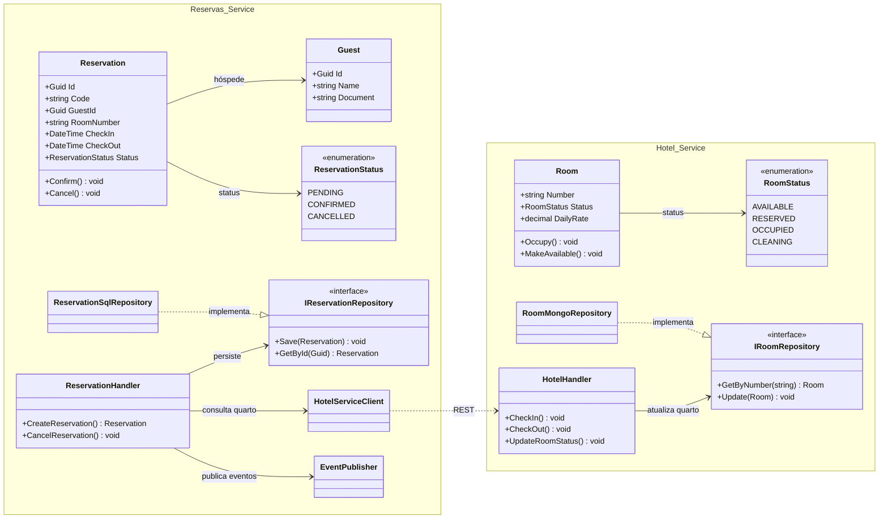

# Diagrama de Classes do Backend — CloudInn

Este documento apresenta o diagrama de classes arquitetural dos microsserviços do backend do **CloudInn**: o **Reservas Service** (responsável por hóspedes e reservas, integrado ao **Azure SQL / Atlas SQL**) e o **Hotel Service** (responsável por quartos, diárias, taxas, funcionários, check-in, check-out e governança, integrado ao **MongoDB Atlas**).

A modelagem é organizada com base nos princípios de **Vertical Slice Architecture** e **Clean Architecture**, demonstrando a independência de cada fatia vertical (_slice_), o encapsulamento de comandos, consultas, validadores, manipuladores (_handlers_), entidades de domínio e abstrações de infraestrutura.

---

## 1. Diagrama de Classes Geral por Vertical Slices

---

## 2. Destaques de Arquitetura de Classes

1. **Vertical Slice Architecture**: Cada funcionalidade possui seu próprio _Command_ ou _Query_, _Validator_, _Handler_ e _DTO_, eliminando acoplamentos horizontais entre casos de uso não correlacionados.
2. **Clean Architecture e Dependency Inversion**: Os _Handlers_ dependem unicamente de interfaces (`IReservationRepository`, `IRoomRepository`, `IEventPublisher`), enquanto as classes de persistência (`ReservationSqlRepository` e `RoomMongoRepository`) residem na camada de infraestrutura.
3. **Persistência Poliglota Especializada**:
   - `ReservationSqlRepository` e `GuestSqlRepository` utilizam **Azure SQL** para transações atômicas ACID, garantindo invariantes financeiras e evitando _overbooking_.
   - `RoomMongoRepository`, `CleaningTaskMongoRepository` e `StaffMongoRepository` utilizam **MongoDB Atlas** para estruturas flexíveis de documentos, histórico de auditoria e alta performance de consulta.
